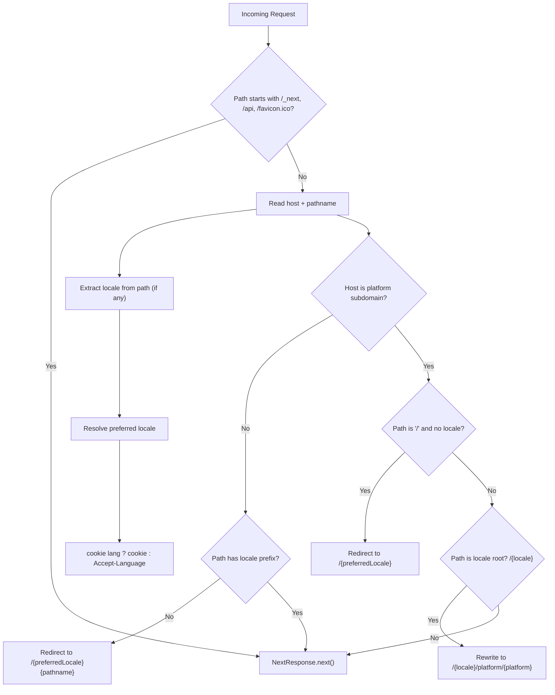

# Routing Technical Flow (Locale + Subdomain)

## Source of truth

- Runtime entry: `proxy.ts`
- Locale helpers: `lib/i18n.ts`, `lib/i18n-server.ts`
- Subdomain helpers: `lib/domain.ts`

## Notes for AI agents

- Đừng thay đổi thứ tự redirect/rewrite nếu không có lý do rõ ràng.
- Mọi URL public nên ưu tiên dạng `/{locale}/...`.
- Subdomain platform phải giữ được locale trên path.
