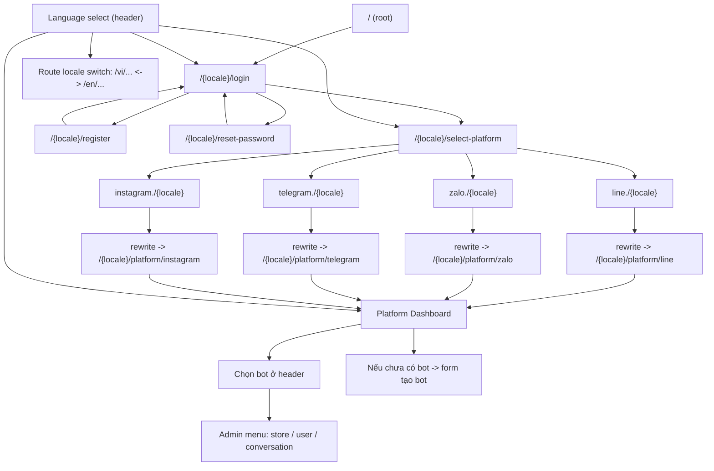

# Screen Flow Graph

## Ghi chú nhanh

- Flow subdomain được xử lý ở `proxy.ts`.
- Locale được bind trên router (`/{locale}/...`) và đổi bằng dropdown header.
- Dashboard dùng chung layout, chỉ đổi theme/logo theo platform.
